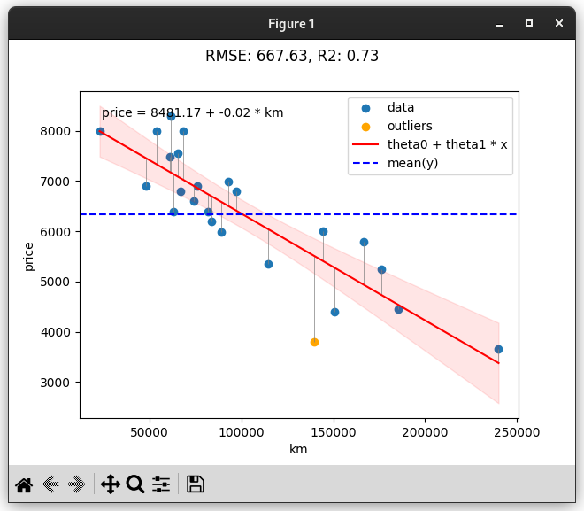
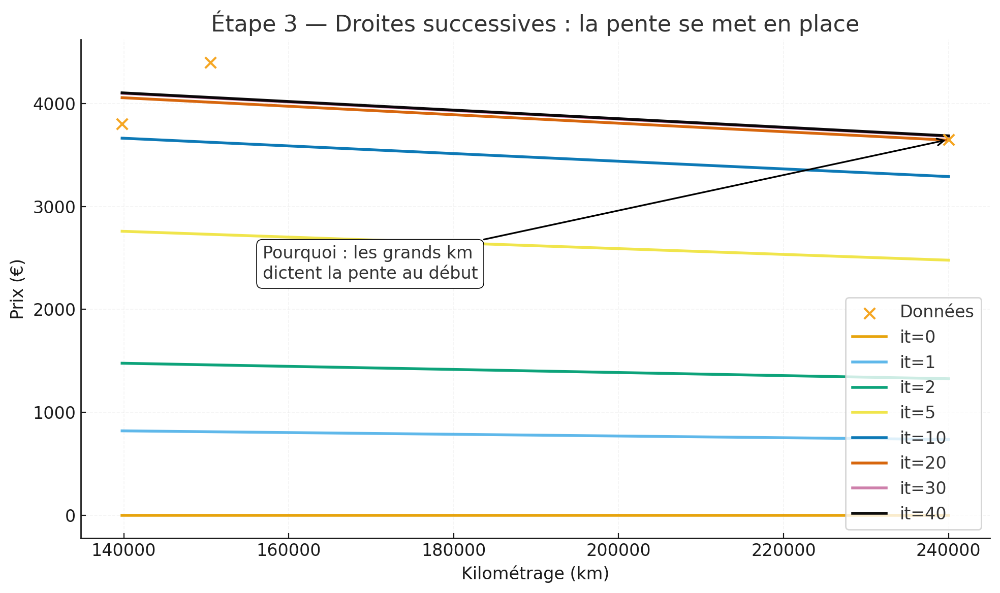

# ft_linear_regression 

<div align="center">


[](https://github.com/raveriss/ft_linear_regression/actions)
[](https://codecov.io/gh/raveriss/ft_linear_regression)
[]()
[]()
[]() 
[]()
[]()
[]()

</div>

---
## 📑 Table des matières
- [🚀 Objectif du projet](#-objectif-du-projet)
- [🧰 Stack technologique](#-stack-technologique)
- [⚡ Démarrage rapide](#-démarrage-rapide)
- [🛠️ Commandes Make](#-commandes-make)
- [🧪 Procédure de soutenance](#-procédure-de-soutenance-e2e-défense-proof)
- [📦 Utilisation](#-utilisation)
- [📝 Données](#-données)
- [🧠 Architecture](#-architecture)
- [🛠️ Fichiers de configuration](#fichiers-de-configuration)
- [🧪 Tests](#-tests)
- [🔍 Qualité du code](#-qualité-du-code)
- [📚 Documentation liée](#-documentation-liée)
- [🛡️ Licence](#licence)

---

## 🚀 Objectif du projet
Implémenter **un premier algorithme de Machine Learning** : une **régression linéaire simple**.  

👉 Prédire le **prix d’une voiture** en fonction de son kilométrage via :  
```math
estimate_price(x) = θ₀ + θ₁ * x
```


- **Deux programmes obligatoires** :  
  - `train.py` → entraîne le modèle (descente de gradient, mise à jour simultanée de θ).  
  - `predict.py` → prédit un prix à partir d’un kilométrage (0 avant entraînement).  

🎯 Conformité stricte à l’énoncé 42 :  
- Pas de `numpy.polyfit` / `sklearn.LinearRegression`.  
- θ sauvegardés entre runs dans `theta.json`.  
- Prédiction = **0 avant tout entraînement**.  
- Pas de crash en soutenance.

---

## 🧰 Stack technologique
- **Python** : 3.10.18 (Ubuntu 22.04.5 Jammy)  
- **Gestion dépendances** : [Poetry](https://python-poetry.org/)  
- **Qualité / CI** : `pytest`, `coverage`, `ruff`, `mypy`, `mutmut` (mutation testing)  
- Visualisation (**bonus uniquement**) : matplotlib (installé **sur demande** via `poetry install --with viz`)


---

## ⚡ Démarrage rapide

> En cas d’entrée invalide (ex. kilométrage négatif ou non numérique) : le programme écrit un message `ERROR: ...` sur **stderr** et quitte avec **exit 2**.


### 🔧 Installation
```bash
# Avec Poetry (recommandé)
poetry install --with dev
```

> ℹ️ Bonus non installé par défaut  
> Pour activer **uniquement** la visualisation bonus :  
> `poetry install --with viz --with dev`


### ▶️ Lancement
```bash
# Entraînement
poetry run train --data data/samples/data.csv --alpha 0.1 --iters 1000 --theta theta.json


# Prédiction
poetry run predict 85000 --theta theta.json
```

> ℹ️ Si la droite rouge affichée par `viz` reste quasiment horizontale, vérifiez
> le contenu de `theta.json`. Une valeur de `--alpha` trop faible (par exemple
> `1e-7`) laisse les coefficients proches de zéro. Utilisez `--alpha 0.1` (ou
> `0.01`) et suffisamment d'itérations pour obtenir une pente négative réaliste.

## 🛠️ Commandes Make

Les principales cibles du [Makefile](./Makefile) facilitent l'installation, la qualité du code et l'utilisation du modèle :

| Commande | Description |
| --- | --- |
| `make install` | Installe les dépendances avec Poetry (groupe dev inclus). |
| `make lint` | Analyse statique du code avec Ruff. |
| `make format` | Formate le code et applique les corrections automatiques de Ruff. |
| `make type` | Vérifie les types avec Mypy. |
| `make test` | Lance les tests unitaires via Pytest. |
| `make cov` | Produit les rapports de couverture (JSON, HTML, console). |
| `make mut` | Exécute les tests de mutation avec Mutmut. |
| `make train` | Entraîne le modèle ; variables personnalisables : `DATA`, `ALPHA`, `ITERS`, `THETA`. |
| `make predict [km]` | Prédit le prix pour un kilométrage donné. |
| `make viz` | (Bonus) Affiche les données et la droite de régression. |


## 🧪 Procédure de soutenance (E2E “défense-proof”)

Scénario officiel à démontrer en soutenance, en trois étapes **obligatoires** :

**Étape A :** prédiction avant tout entraînement  
Suppression du fichier de paramètres
```bash
rm -f theta.json
python3 -m src.predict 50000 --theta theta.json
```
→ Résultat attendu : 0 (θ₀=0, θ₁=0 par défaut)

**Étape B :** entraînement du modèle

```bash
poetry run train --data data.csv --alpha 0.1 --iters 1000 --theta theta.json
```
→ Apprentissage des paramètres θ₀ et θ₁, sauvegardés dans theta.json

**Étape C :** prédiction après entraînement
→ Résultat attendu : prix non nul, cohérent avec la droite apprise (≈ CSV)
```bash
python3 -m src.predict 50000 --theta theta.json
```
⚠️ Ces trois étapes doivent être **reproductibles à l’identique** devant le jury.
Tout écart (crash, valeur incohérente, absence de 0 en étape A, MAJ non simultanée de θ) = **échec en défense.**

### (Bonus) Visualisation
> Évaluable **uniquement si le mandatory est parfait**. Non requis pour la soutenance.
### Si vous avez installé le groupe bonus viz :
```bash
poetry run python -m src.viz --data data.csv --theta theta.json --show-residuals
```
Ajoutez `--show-residuals` pour tracer des lignes verticales représentant les résidus.
Utilisez `--sigma-k` (défaut `2`) pour colorer en orange les points dont
`|résidu| > k·σ`; ils sont ajoutés à la légende sous le nom « outliers ».
<p align="center">
  
  <br><em>Nuage de points et droite θ₀ + θ₁·x (après entraînement).</em>
</p>

---

## 📦 Utilisation
- **Mode interactif** : `predict.py` demande un kilométrage si non fourni.
    ### Exemple concret
```bash
$ make predict 
poetry run predict --theta theta.json
Enter mileage: 23000
Predicted price: 7991.88 €
```
- **End-to-End** : `predict (0)` → `train` → `predict ≈ prix`.  

---

## 📝 Données
- Fichier : [`data/samples/data.csv`](./data/samples/data.csv) (colonnes `km,price`).  
- Hypothèses :  
  - km ≥ 0  
  - valeurs numériques uniquement  
  - 24 lignes d’exemple (corrélation ≈ −0,86)

---

## 🧠 Architecture
```
.
├── author
├── CONTRIBUTING.md
├── data.csv
├── LICENSE
├── Makefile
├── README.md
└── src
    ├── linear_regression.py
    ├── metrics.py
    ├── predict
    │   ├── __init__.py
    │   ├── __main__.py
    │   └── predict.py
    ├── train
    │   ├── __init__.py
    │   ├── __main__.py
    │   └── train.py
    └── viz.py
```

*(Bonus : `viz.py` affiche données + droite de régression)*
*Les tests E2E vérifient aussi les **messages d’erreurs exacts** (snapshot) et les **codes de sortie** (0/1/2).*

---

<h2 id="fichiers-de-configuration">🛠️ Fichiers de configuration</h2>

- `pyproject.toml` (Poetry, dépendances, lint, type check)
  - Groupe optionnel **[tool.poetry.group.viz]** (non installé par défaut, réservé au **bonus**)
- `requirements.txt` (fallback sans Poetry)
- `.coveragerc`, `.gitignore`, `Makefile` (raccourcis CI/CD)
- **Note** : `theta.json` est listé dans `.gitignore` → *ne jamais le versionner*.

---

## 🧪 Tests
- Portée des tests (mandatory) : `train.py`, `predict.py`, `io_utils.py`, CLI, I/O θ, stratégie GD.  
- `viz.py` est **hors** mandatory et **hors périmètre** des exigences minimales (peut être testé si le bonus est activé).

### Unitaire
- Comparaisons float avec `pytest.approx` uniquement (`rtol=1e-2`), jamais `==`.  
- Test dédié qui échoue si la mise à jour des θ n’est pas **simultanée** (utilisation de temporaires).  
- Tests robustesse I/O : CSV manquant, colonnes inattendues, valeurs non numériques, JSON `theta` absent/corrompu.  
- Vérification des **messages d’erreurs et codes retour** (exemples attendus) :  
  - `ERROR: invalid CSV format (expected columns: km,price)` → exit 2  
  - `ERROR: invalid mileage (must be a non-negative number)` → exit 2  
  - `ERROR: theta file not found: <path>` → exit 2  

### End-to-End
- `predict(0)=0` → `train` → `predict(km_csv) ≈ price`.  
- CLI `--help` (exit 0), erreurs d’options (exit ≠ 0, message).  
  - Entrée interactive : prompt si kilométrage manquant, gestion EOF/pipe.

### Couverture stricte (100 % global + diff + contrôle par fichier)
```bash
pytest -q
coverage run -m pytest
coverage json
coverage report --fail-under=100
coverage html --skip-empty --show-contexts
```

## 🧾 Codes de sortie & messages d’erreur (contrat “défense‑proof”)

Les programmes doivent **imprimer ces messages à l’identique sur stderr** et quitter avec le **code indiqué**.

- `ERROR: theta file not found: <path>` → **exit 2**
- `ERROR: invalid CSV format (expected columns: km,price)` → **exit 2**
- `ERROR: invalid mileage (must be a non-negative number)` → **exit 2**

Règles générales :
- **0** : exécution nominale (train/predict OK).
- **2** : erreur d’usage/entrée/I‑O/validation (fichier manquant, CSV invalide, saisie invalide, etc.).
- **1** : erreur interne inattendue (exception non prévue).

Tests recommandés :
- Snapshot minimal des messages d’aide (`--help`) et d’erreur (texte essentiel, stable).
- Asserts explicites sur `returncode` (0, 1 ou 2 selon les cas).

✅ **Objectifs qualité (mandatory)** :  
- Coverage **100 %** (statements + branches + diff + contrôle fichier).  
- Mutation testing **≥90 %** (scope global mandatory, avec survivants justifiés).  
- **Tolérance floats stricte** : toujours utiliser `pytest.approx(..., rel=1e-2)` (jamais `==` sur floats).  
- **Test dédié “MAJ simultanée”** : un test échoue explicitement si θ₀, θ₁ sont mis à jour séquentiellement (sans temporaires).  
- Tests E2E : `predict(0)=0 → train → predict≈csv`.  
- Tests robustesse I/O : CSV manquant, mal formé, km négatif, NaN, EOF/pipe.  
- Tests CLI : `--help`, erreurs d’options → exit ≠ 0 avec message clair.  
- Codes retour : 0 succès, ≠0 échec.  

---

## 🔍 Qualité du code
- Formatage & imports : `ruff format`, `isort`.  
- Typage statique : `mypy`.  
- Lint : `ruff check`.  
- CI/CD Ubuntu-only (GitHub Actions).  
- Hooks `pre-commit` pour vérifier format/lint/tests rapides avant commit.  
---
## 📚 Documentation liée
- [`AGENTS.md`](./AGENTS.md) → Blueprint complet CI/CD + checklist défense-proof.  
- [`ft_linear_regression_checklist_défense-proof.txt`](./ft_linear_regression_checklist_défense-proof.txt) → Qualité tests & couverture.  
- [`ft_linear_regression_murphy_law.txt`](./ft_linear_regression_murphy_law.txt) → Risques & contre-mesures.  
- Énoncé officiel : [ft_linear_regression.en.subject.pdf](./ft_linear_regression.en.subject.pdf).  
- Le bonus est **cloisonné** : il ne doit pas interférer avec le mandatory ni impacter la CI de base.

---

## 🎨 Visuel clé (bonus)
<p align="center">
  <a href="./docs/assets/plots/regression/etape3_droites_successives.png">
    
  </a>
  <br><em>La pente se met en place itération par itération (cliquer pour la galerie).</em>
</p>

➡️ Voir la galerie complète : [docs/regression_lineaire.md](./docs/regression_lineaire.md)

---

## 📊 Bonus : Bande de confiance 95 %

Une analyse pédagogique pas à pas montre **pourquoi** la bande est
étroite au centre et large aux extrêmes.

<p align="center">
  
  <br><em>Bande de confiance autour de la droite de régression (extrait).</em>
</p>

👉 Voir [docs/confidence_band.md](./docs/confidence_band.md)

---

## 📖 Ressources utilisées

Les contenus suivants ont été essentiels pour comprendre et implémenter la régression linéaire et l’algorithme du gradient :

- 🎥 [Playlist YouTube — Machine Learning from Scratch](https://www.youtube.com/playlist?list=PLO_fdPEVlfKqUF5BPKjGSh7aV9aBshrpY)  
  Série pédagogique détaillant les fondements du Machine Learning et la régression linéaire.

- 📄 [Wikipédia — Fonction linéaire (analyse)](https://fr.wikipedia.org/wiki/Fonction_lin%C3%A9aire_(analyse))  
  Définitions et propriétés mathématiques de la fonction linéaire.

- 📄 [Wikipédia — Algorithme du gradient](https://fr.wikipedia.org/wiki/Algorithme_du_gradient)  
  Explication théorique de la descente de gradient et de ses applications en optimisation.


<h2 id="licence">🛡️ Licence</h2>
MIT © 2025 — raveriss  
