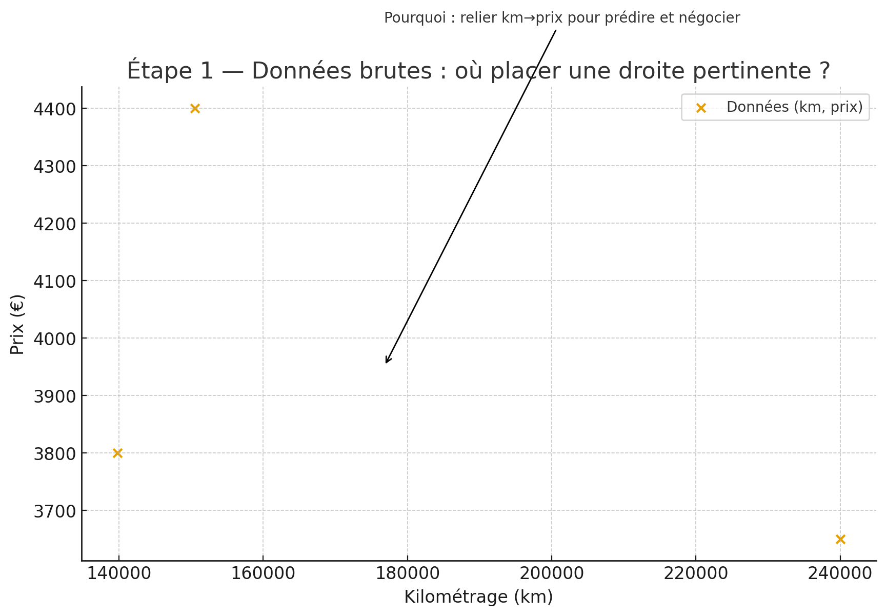
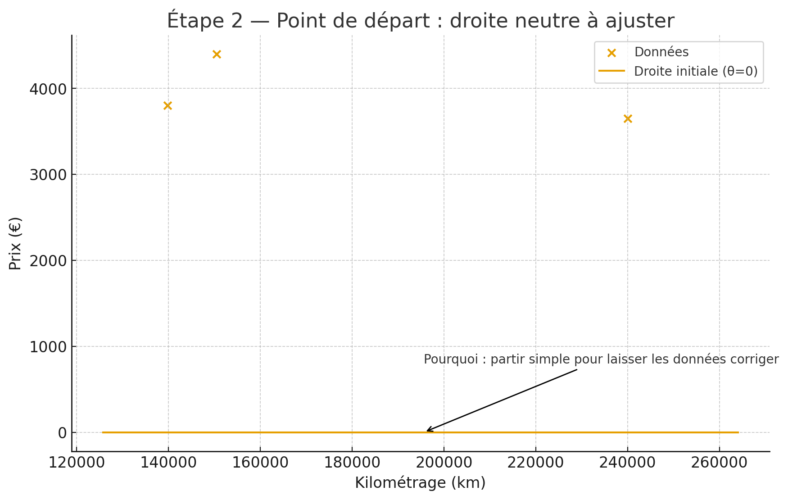
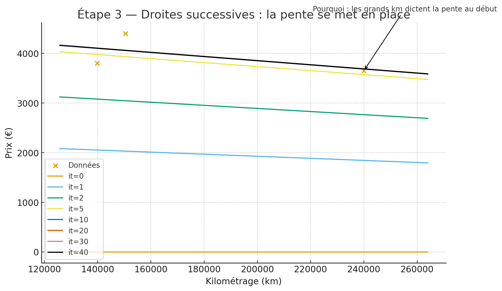
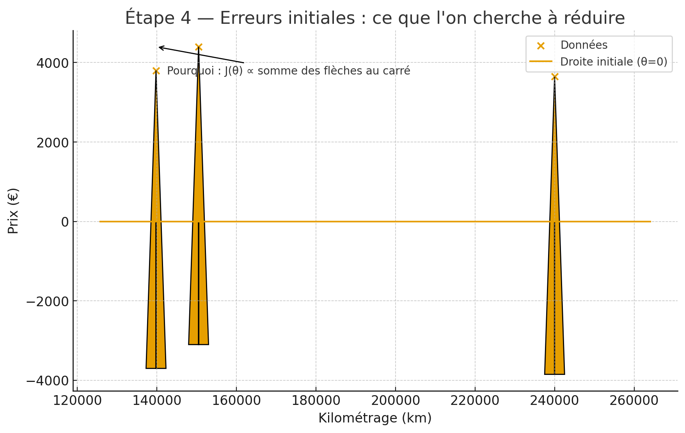
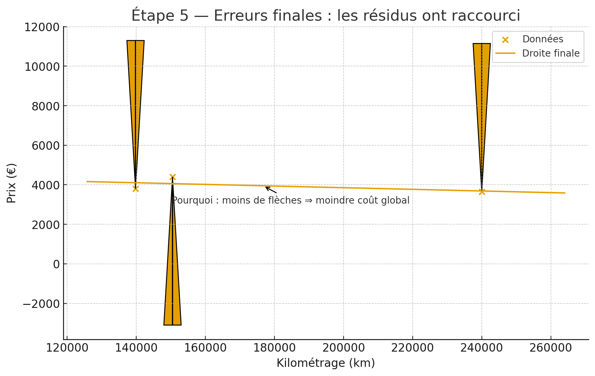
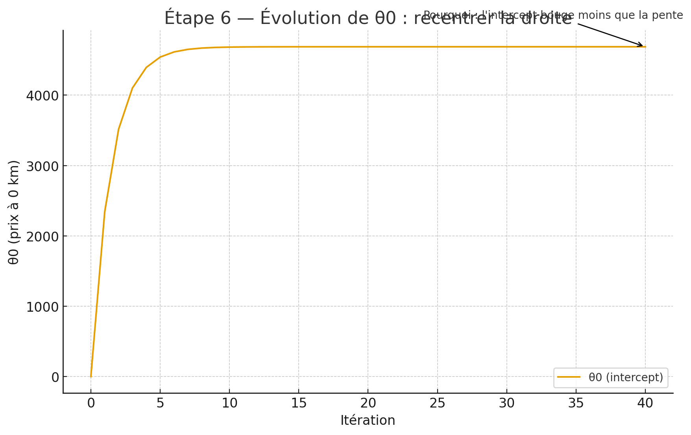
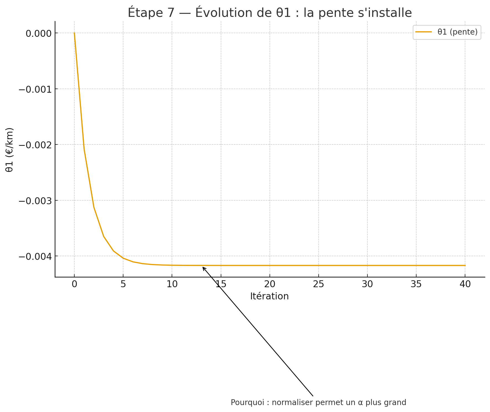
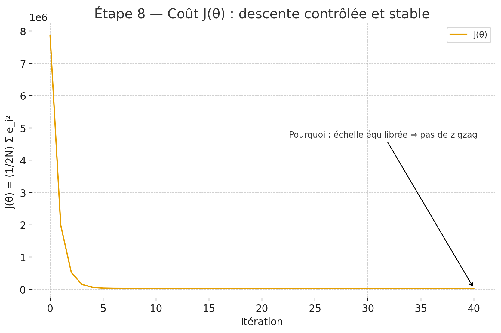

# Galerie — Descente de gradient (Pourquoi > Comment)

> Chaque figure illustre le « pourquoi » de l’étape.
> Les images sont **générées par script** (cf. `scripts/gen_plots.py`).

## Étape 1 — Données brutes

*Pourquoi : relier km → prix pour prédire et négocier.*

## Étape 2 — Point de départ

*Pourquoi : partir simple pour laisser les données corriger.*

## Étape 3 — Droites successives

*Pourquoi : les grands km dictent la pente au début.*

## Étape 4 — Erreurs initiales

*Pourquoi : J(θ) ∝ somme des flèches au carré.*

## Étape 5 — Erreurs finales

*Pourquoi : moins de flèches ⇒ moindre coût global.*

## Étape 6 — Évolution de θ0

*Pourquoi : l’intercept bouge moins que la pente.*

## Étape 7 — Évolution de θ1

*Pourquoi : normaliser permet un α plus grand.*

## Étape 8 — Coût J(θ)

*Pourquoi : échelle équilibrée ⇒ pas de zigzag.*
