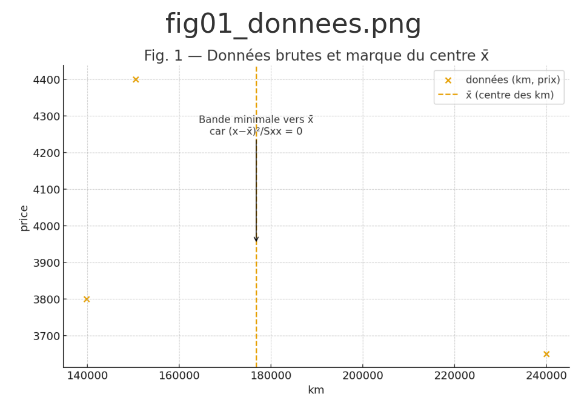
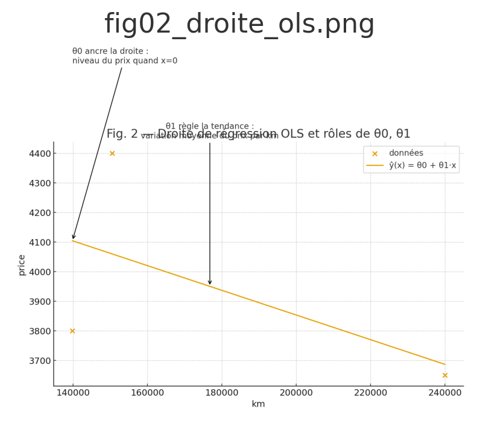
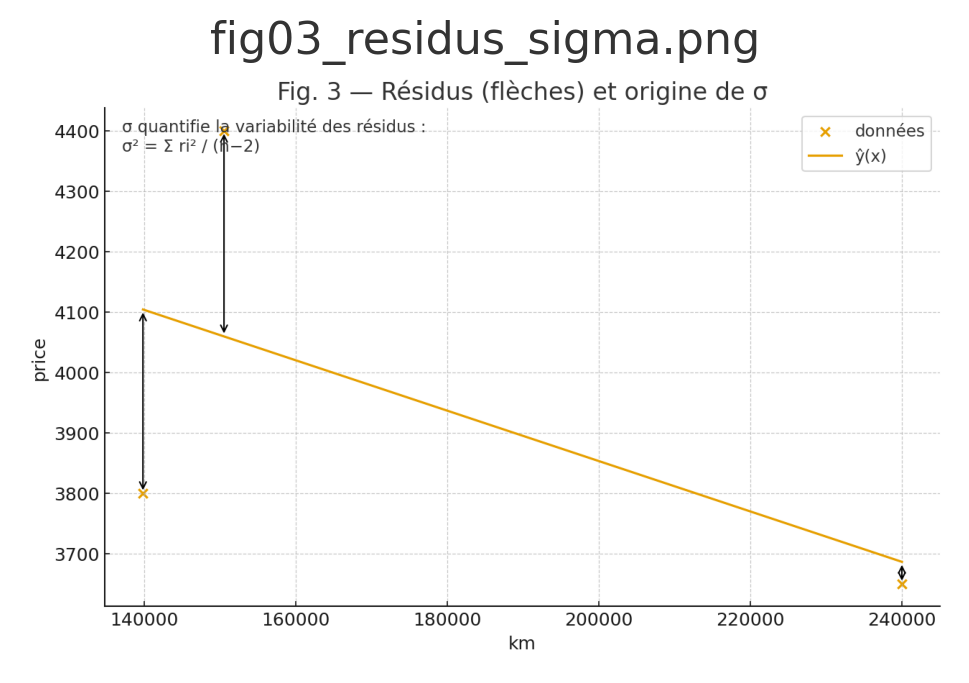
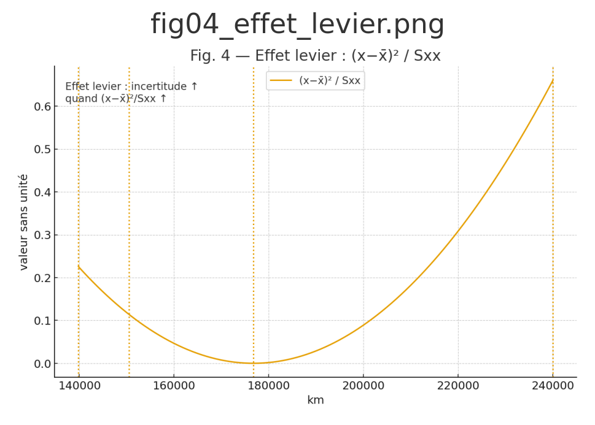
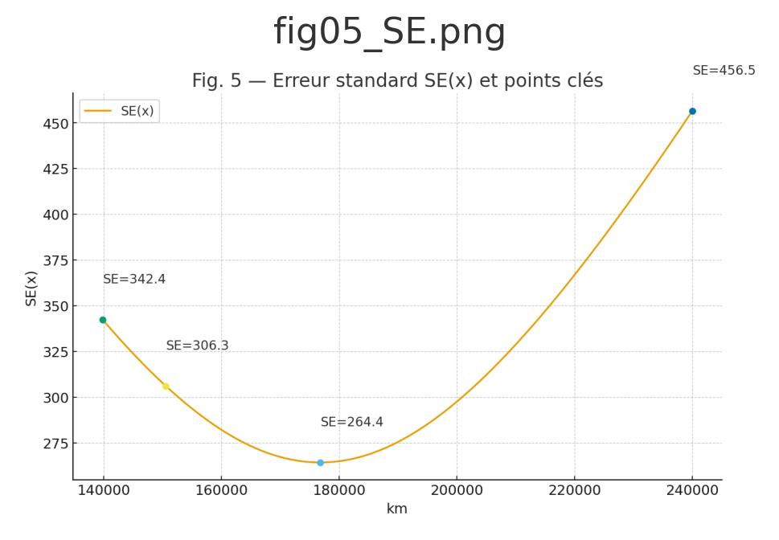
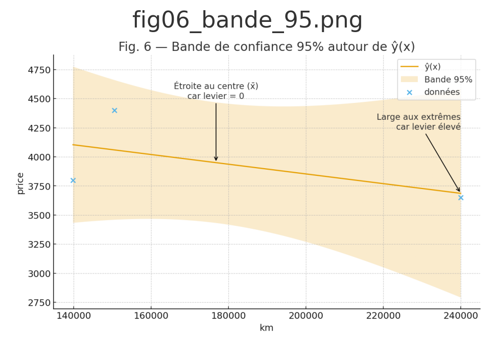
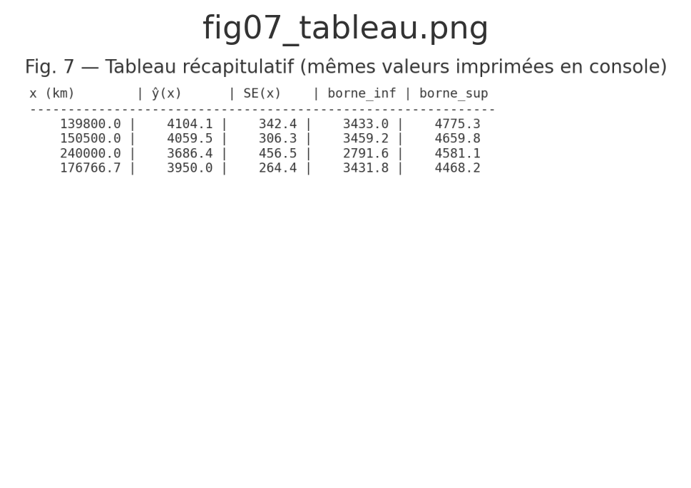

# Galerie — Bande de confiance 95 % (Pourquoi > Comment)

> Chaque figure illustre le **« pourquoi »** de l’étape.  
> Les images sont **générées automatiquement** (cf. `scripts/gen_confidence_band.py`).

---

## Étape 1 — Données brutes
  
*Pourquoi : situer les points observés et le centre x̄ où la bande sera minimale.*

---

## Étape 2 — Droite OLS
  
*Pourquoi : θ₀ fixe le niveau de départ, θ₁ traduit la tendance prix ↔ km.*

---

## Étape 3 — Résidus et σ
  
*Pourquoi : les résidus mesurent l’écart modèle ↔ réalité ; leur dispersion définit σ.*

---

## Étape 4 — Effet levier
  
*Pourquoi : plus (x−x̄)²/Sxx est grand, plus l’incertitude s’élargit aux extrêmes.*

---

## Étape 5 — Erreur standard SE(x)
  
*Pourquoi : SE(x) combine σ et l’effet levier ; elle est minimale à x̄ et croît loin du centre.*

---

## Étape 6 — Bande de confiance 95 %
  
*Pourquoi : la bande est serrée au centre (levier nul), large aux bords (levier fort).*

---

## Étape 7 — Tableau récapitulatif
  
*Pourquoi : chiffres clés pour x ∈ {139 800, 150 500, 240 000, x̄} → comprendre la largeur de la bande.*

---
